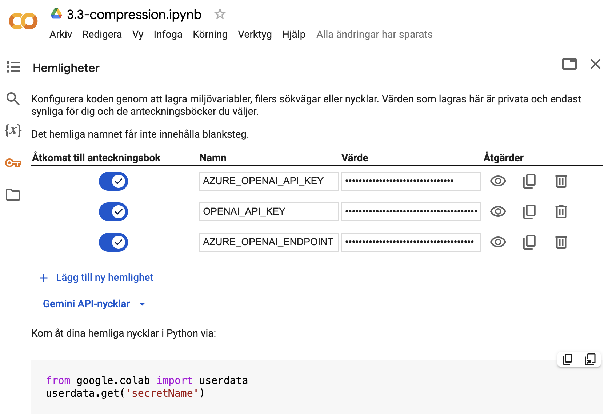

# AI Workshop 2025-01-21


För att kunna delta i labbandet med RAG- och agent-agentapplikationer behöver du ha en utvecklingsmiljö för Pyton (se alternativen nedan).
**Enklast är** att använda en virtuell miljö i molnet (**alternativ 1 eller 2**), men har man Python installerat på sin dator går det också bra att laborera lokalt. När det gäller alternativ 1 och 2 är den enda förberedelsen att du ser till att ha ett konto klart i förväg - sjäva miljöerna sätter vi upp under labben.

1. **Google Colab**: En virtuell playground-miljö för Jupyter notebooks.
   **Kräver ett Google-konto.** Läs mer här: https://colab.research.google.com

2. **GitHub Codespaces**: En komplett virtuell utvecklingsmiljö med VSCode.
   **Kräver att du har ett GitHub-konto** (samt att du inte redan har förbrukat din månatliga "pott"). Läs mer här: https://github.com/features/codespaces

3. **Använd en befintlig lokal Pyton-miljö (3.11 eller 3.12 rekommenders)**


_**API-nycklar**_ mm kommer att tillhandahållas vid labben via separat länk.


_**Detaljerade instruktioner följer nedan:**_

-----


## Instructions for getting started - in 4 different ways

1. **Use Google Colab (requires a Google account)**:
    - Click the corresponding _**`Open in Google Colab`**_ link below.
    - Configure "Secrets" / API-keys (reachable from the left-hand menu).
      

2. **Use GitHub Codespaces - (requires a GitHub-account)**:
    - _(Optional first step if you want to save your changes: **Fork this repo**)_ <br/>
      

    - Click "Code" and then "Create codespace on main" in the GitHub UI<br/>
      <br/>
      
      <br/>

    - Wait for the codespace to be created and then create a `.env` file with the API-keys.
      (_**See below for screenshots**_)

3. **If you have a decently up-to-date local Pyton environment (3.11 or 3.12)**:
    - Clone this repo
    - Create a `.env` file with the API-keys.
    - Activate the virtual environment:
      ```bash
         python -m venv venv
 
         # On Windows:
         .\venv\Scripts\activate
 
         # On MacOS/Linux:
         source venv/bin/activate
 
         pip install -r requirements.txt
      ``` 


## Jupyter Notebooks Colab links

Open notebook here on GitHub and then click the "Open in Colab" button (like the one below).<br/>

